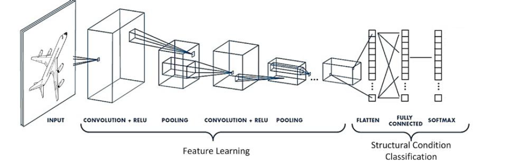
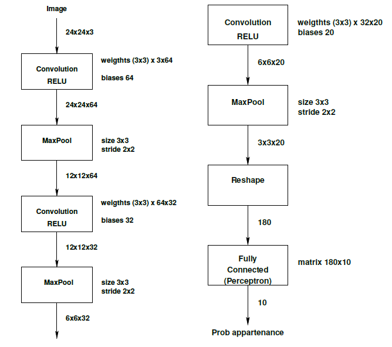
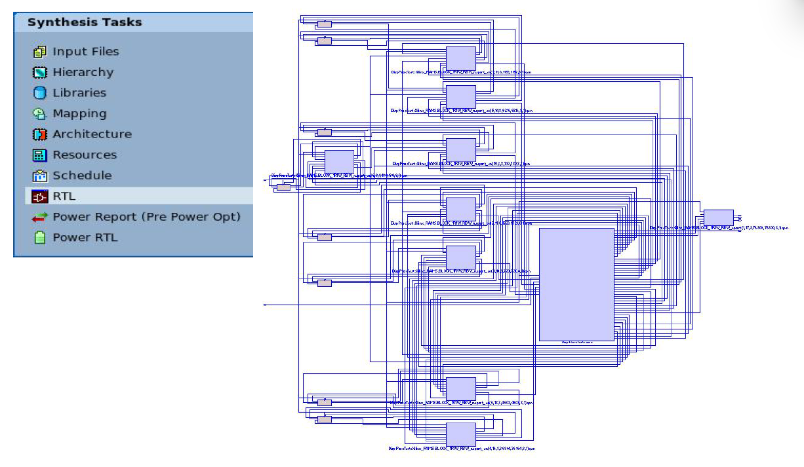
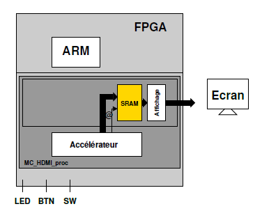

# **High Level Synthesis : CNN for Hardware**
<p align="center">
    
</p>

## **Project steps's**
This project concerns the implementation of a neural network (CIFAR-10 dataset) on an FPGA. It is divided into three (03) parts:

1. Part 1: Implementation of the network in Python to establish a baseline.
2. Part 2: Floating-point (**double**) implementation in C++.
3. Part 3: C++ fixed-point implementation (**ac_fixed**).

<p align="center">
    
</p>

## **HLS Integration : CatapultC & Precision**
We use High Level Synthesis with Mentor Graphics CatapultC to perform the high-level synthesis of our code to generate the RTL code. Once the RTL code has been generated, we use the Precision tool to perform formal hardware verification.  This tool is used to check the conformity of a hardware design with certain specifications or to detect potential errors in the design.

<p align="center">
    
</p>

## **Bitstream generation**
The outpput of Precision is used by Vivado to generate the bitstream to be loaded onto the FPGA board. We use a prototyping platform based on the following scheme: 

<p align="center">
    
</p>


## Execution
1. **Python**
    ```bash
    python top.py
    ```

2. **Cpp_reference**
    ```bash
    make all
    ./top_cnn_reference
    ```

3. **Cpp_hardware**
    ```bash
    make all
    ./top_cnn_hardware
    ```
